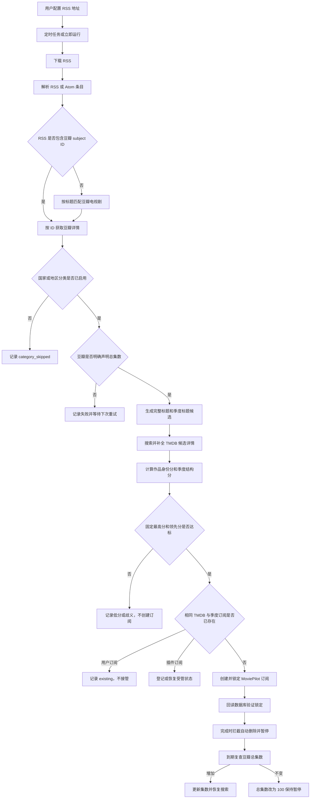

# MoviePilot 豆瓣订阅助手开发交接文档

> 本文档面向接手本仓库的开发者或其他代码工具。开始修改前，请完整阅读本文档和根目录的 `豆瓣接口与TMDB电视剧匹配设计.md`。

## 1. 项目概况

### 1.1 仓库信息

| 项目 | 当前值 |
| --- | --- |
| GitHub 仓库 | `https://github.com/tony3080/MoviePilot-Plugins1` |
| 仓库可见性 | Public |
| 默认分支 | `main` |
| 插件 ID | `DoubanSubscribe` |
| 插件目录 | `plugins.v2/doubansubscribe/` |
| 当前插件版本 | `0.3.0` |
| 最近公开基线提交 | `64ed2f8c751048013bbe599111a9c64765ad788d`（0.2.1） |
| 最低 MoviePilot 版本 | `>=2.15.0` |
| Python 测试版本 | 3.11 |

本地工作区最初位于：

```text
C:\Users\Administrator\Desktop\MP订阅插件
```

### 1.2 用户原始目标

用户希望实现以下流程：

1. 用户自行填写一个或多个 RSS 地址，例如：

   ```text
   http://192.168.110.31:9150/rsshub/hot_tv
   ```

2. 插件从 RSS 获取电视剧条目。
3. 插件从豆瓣查询条目详情和豆瓣声明的总集数。
4. 插件按照 `豆瓣接口与TMDB电视剧匹配设计.md` 的方案匹配 TMDB 作品和季度。
5. 插件向 MoviePilot 创建电视剧订阅。
6. 写入订阅的总集数必须来自豆瓣，不能来自 TMDB。
7. 写入后锁定总集数，禁止 MoviePilot 后续使用 TMDB 集数覆盖。
8. 后续再增加筛选、人工确认等小功能。

### 1.3 当前完成程度

已经完成：

- MoviePilot V2 插件市场结构和元数据。
- RSS 2.0、Atom 解析。
- RSS 豆瓣链接 ID 提取和条目去重。
- 豆瓣详情获取及明确总集数提取。
- 中文、阿拉伯数字、罗马数字季度标题候选。
- 完整标题、原标题、别名多路径 TMDB 搜索。
- TMDB 作品身份与季度结构的确定性评分。
- 最低分和领先分双阈值决策。
- MoviePilot 订阅创建。
- 豆瓣总集数写入和 `manual_total_episode=1` 锁定。
- 创建后的数据库回读校验。
- 定时任务、立即运行 API、处理历史 API、配置页面和历史页面。
- RSS 条目按豆瓣国家或地区分类，可筛选国产剧、欧美剧、日韩剧和其他地区。
- 订阅完成前拦截 MoviePilot 自动删除，将插件受管卡片改为暂停。
- 按“确认完成天数”延迟复查豆瓣总集数；增加时恢复搜索，不变时改为 100 并交给用户。
- 详情页改用 MoviePilot 官方插件实际使用的 `VDataTableVirtual`，同时展示受管订阅和 RSS 历史。
- 纯逻辑测试、仓库契约测试及 GitHub Actions。

尚未完成或尚未验证：

- 尚未在用户真实运行中的 MoviePilot 宿主内完成豆瓣、TMDB、数据库全链路联调。
- 尚无 TMDB 候选人工确认页面。
- 尚未实现 IMDb/TVDB 外部 ID 精确候选。
- 尚未实现繁简体候选转换。
- 只接管本插件以“豆瓣订阅助手”用户创建的订阅，不接管用户自行创建的同名订阅。
- 尚未实现完整的请求重试、退避和速率控制。

## 2. 仓库结构

```text
.
├── .github/
│   └── workflows/
│       └── validate.yml
├── plugins.v2/
│   └── doubansubscribe/
│       ├── __init__.py
│       ├── core.py
│       └── README.md
├── tests/
│   ├── test_core.py
│   ├── test_lifecycle.py
│   └── test_repository.py
├── package.json
├── package.v2.json
├── README.md
├── LICENSE
├── 豆瓣接口与TMDB电视剧匹配设计.md
└── 开发交接文档.md
```

各文件职责：

| 文件 | 职责 |
| --- | --- |
| `plugins.v2/doubansubscribe/__init__.py` | MoviePilot 插件入口、配置、调度、宿主 API 调用、订阅创建 |
| `plugins.v2/doubansubscribe/core.py` | 不依赖 MoviePilot 的 RSS 解析、标题处理、数据模型、评分和决策 |
| `plugins.v2/doubansubscribe/README.md` | 面向插件使用者的简要说明 |
| `package.v2.json` | MoviePilot V2 插件市场索引 |
| `tests/test_core.py` | 核心纯逻辑测试 |
| `tests/test_lifecycle.py` | 隔离宿主依赖，模拟完成暂停、豆瓣复查、恢复搜索和手动接管 |
| `tests/test_repository.py` | 插件结构、元数据和订阅锁定调用契约测试 |
| `豆瓣接口与TMDB电视剧匹配设计.md` | 完整匹配设计、证据权重、风险分析和案例 |
| `.github/workflows/validate.yml` | GitHub Actions 编译、JSON 和单元测试校验 |

## 3. 总体数据流



入口方法是 `DoubanSubscribe.sync()`。每个条目的主流程位于 `_process_item()`。

## 4. 核心数据模型

数据模型位于 `plugins.v2/doubansubscribe/core.py`。

### 4.1 `FeedItem`

标准化后的 RSS 条目：

```python
FeedItem(
    title: str,
    link: str,
    guid: str,
    description: str,
    published: str,
    source_url: str,
    douban_id: Optional[str],
    year: Optional[str],
    poster: str,
)
```

唯一键规则：

- 有豆瓣 ID：`douban:<douban_id>`。
- 没有豆瓣 ID：对链接、GUID、标题和年份做 SHA-256，取前 24 位，形成 `rss:<hash>`。

### 4.2 `TitleHypothesis`

表示一种标题解释：

```python
TitleHypothesis(
    title: str,
    season: Optional[int],
    mode: str,
    strength: str,
)
```

当前 `mode` 可能是：

- `exact_title`
- `original_title`
- `alias_title`
- `base_and_season`

当前 `strength` 可能是：

- `exact`
- `strong`
- `weak`

### 4.3 `TmdbCandidate`

只保存评分所需的 TMDB 事实，包括：

- `tmdb_id`
- 标题、原标题、别名
- 整剧年份
- 目标季度
- 目标季度年份
- 目标季度集数
- 演员和导演
- 候选来源模式和标题假设

电视剧候选的唯一键必须始终是：

```text
(tmdb_id, season)
```

不能只用 `tmdb_id` 去重，否则会丢失同一电视剧不同季度。

### 4.4 `ScoredCandidate` 与 `MatchDecision`

`ScoredCandidate` 保存身份分、结构分、总分和证据文字。`MatchDecision` 保存最终是否接受、状态、原因、获胜候选和最多五个备选。

## 5. RSS 处理

### 5.1 支持格式

`parse_feed()` 使用 Python 标准库 `xml.etree.ElementTree`，当前支持：

- RSS 2.0 的 `<item>`。
- Atom 的 `<entry>`。

读取字段：

- `title`
- `link`
- `guid` 或 Atom `id`
- `description`、`summary`、`content` 或 `encoded`
- `pubDate`、`published` 或 `updated`
- `category`

### 5.2 豆瓣 ID 提取

从 `link`、`guid` 和描述 HTML 中查找：

```text
movie.douban.com/subject/<数字ID>
```

用户提供的真实 RSS 已于 2026-07-26 验证：

| 项目 | 验证结果 |
| --- | --- |
| URL | `http://192.168.110.31:9150/rsshub/hot_tv` |
| HTTP 状态 | 200 |
| Content-Type | `application/xml; charset=utf-8` |
| 条目数 | 200 |
| 第一条标题 | `唐朝诡事录之长安` |
| 第一条豆瓣 ID | `36318037` |
| 第一条唯一键 | `douban:36318037` |

该地址属于用户内网，不应视为公共可访问服务。

### 5.3 RSS 请求

宿主层使用 MoviePilot 的 `RequestUtils`：

- 关闭“RSS 使用代理”时：`RequestUtils().get_res(url)`。
- 开启时：`RequestUtils(proxies=settings.PROXY).get_res(url)`。

目前每个 RSS 每轮只请求一次，没有插件级重试和退避。

## 6. 豆瓣处理

### 6.1 豆瓣条目解析顺序

`_resolve_douban()` 的顺序：

1. 优先使用 RSS 中提取到的豆瓣 ID。
2. 没有 ID 时，使用 MoviePilot 的 `self.chain.match_doubaninfo()` 按标题匹配电视剧。
3. 确定 ID 后调用：

   ```python
   self.chain.douban_info(
       doubanid=str(douban_id),
       mtype=MediaType.TV,
       raise_exception=False,
   )
   ```

没有直接调用豆瓣私有 HTTP 接口，签名、缓存和基础限流交给 MoviePilot 宿主处理。

### 6.2 豆瓣总集数提取

`extract_total_episode()` 按以下字段顺序读取正整数：

1. `episodes_count`
2. `episode_count`
3. `total_episode`
4. `total_episodes`
5. `webisode_count`

上述字段均无有效值时，继续从以下文本字段识别“全 36 集”“共 36 集”“36 集全”等格式：

- `episodes_info`
- `card_subtitle`

重要约束：

- 绝不能用 `last_episode_number` 作为总集数。
- 绝不能用 TMDB 集数回填豆瓣总集数。
- 豆瓣没有明确总集数时，返回 `douban_total_missing`，不创建订阅。

## 7. 标题和季度候选

### 7.1 搜索路径

`build_search_hypotheses()` 从以下来源生成候选：

- 豆瓣中文主标题。
- 豆瓣 `original_title`。
- 豆瓣 `aka` 中最多前 8 个别名。

同一标准化标题和季度只保留一次。

### 7.2 强季度标记

以下写法会生成高置信度 `base_and_season`：

- `罚罪 第二季`
- `罚罪 第2季`
- `罚罪 S02`
- `罚罪 Season 2`

即使是强标记，也必须验证 TMDB 确实存在目标季度。

### 7.3 弱季度标记

以下写法只生成低权重候选，不能直接认定：

- `罚罪2`
- `罚罪二`
- `罚罪 II`
- `罚罪 第二部`

弱候选必须依靠目标季度是否存在、季度年份、季度集数、别名和人员信息拉开分差。

### 7.4 原生数字标题保护

以下标题不会被拆成季度：

- `神奇女侠1984`
- `1899`
- `1923`
- `24`
- `三体`
- `二十不惑`

不要删除相关测试。裸数字季度识别是整个匹配流程中误判风险最高的部分。

## 8. TMDB 搜索与评分

### 8.1 TMDB 调用

每个标题假设执行：

```python
meta = MetaInfo(hypothesis.title)
meta.type = MediaType.TV
results = self.chain.search_medias(meta=meta, source="themoviedb")
```

完整标题、原标题和别名路径会附带豆瓣年份；`base_and_season` 路径不把豆瓣季度年份错误当作整剧首播年份传入搜索。

搜索结果再通过以下方式补全详情：

```python
self.chain.recognize_media(
    meta=detail_meta,
    mtype=MediaType.TV,
    tmdbid=tmdb_id,
    cache=False,
)
```

默认最多补全 10 个不同 TMDB ID。内部配置名为 `candidate_limit`，当前默认值为 10，允许范围 1 到 30。这个字段目前未显示在配置界面中，但会从配置读取和持久化。

### 8.2 作品身份评分

| 证据 | 分数 |
| --- | ---: |
| 标准化主标题完全一致 | +35 |
| 原标题完全一致且不同于主标题 | +25 |
| 任一豆瓣别名与 TMDB 标题或别名一致 | +25 |
| 非季度路径年份一致 | +25 |
| 非季度路径年份相差超过 1 年 | -40 |
| 两名及以上主要演员重合 | +15 |
| 一名演员重合 | +8 |
| 导演重合 | +10 |

### 8.3 季度结构评分

仅 `base_and_season` 候选计算以下结构分：

| 证据 | 分数 |
| --- | ---: |
| 强季度标题 | +50 |
| 弱季度标题 | +5 |
| TMDB 标题或别名包含基础剧名 | +20 |
| TMDB 存在目标季度 | +30 |
| TMDB 不存在目标季度 | -100 |
| 目标季度年份一致 | +30 |
| 目标季度年份相差不超过 1 年 | +10 |
| 目标季度年份冲突 | -30 |
| TMDB 季度集数与豆瓣总集数一致 | +25 |
| 集数相差不超过 1 | +10 |
| TMDB 别名包含豆瓣完整续季标题 | +20 |

TMDB 季度集数只是一项匹配证据，不能成为最终订阅总集数。

### 8.4 自动接受条件

默认条件：

```text
最高候选总分 >= 80
且
最高候选领先第二候选 >= 15
```

这里的分数是插件对 TMDB 候选身份和季度证据计算的内部匹配分，不是作品的
豆瓣/TMDB 观众评分。这两个阈值从 0.3.0 起固定为
`MATCH_ACCEPT_SCORE=80` 和 `MATCH_MIN_LEAD=15`，配置页面和保存数据中
不再暴露匹配分设置。

候选先按 `(tmdb_id, season)` 去重，同一键只保留最高分路径。

决策状态：

- `no_candidate`
- `low_score`
- `ambiguous`
- `matched`

无法拉开分差时必须保留为歧义，不能为了自动化率强行选择第一名。

## 9. MoviePilot 订阅创建与集数锁定

### 9.1 最低版本原因

当前代码要求 MoviePilot `>=2.15.0`。该版本的订阅模型已包含：

```python
manual_total_episode = Column(Integer, default=0)
```

MoviePilot 的订阅刷新和完成前刷新路径都会在该字段为真时跳过自动总集数更新。因此不需要修改 MoviePilot 主程序。

运行前还有防御性检查：

```python
hasattr(Subscribe, "manual_total_episode")
```

字段不存在时整轮停止，不创建无法锁定的订阅。

### 9.2 创建参数

`_create_subscription()` 当前调用：

```python
SubscribeChain().add(
    title=mediainfo.title,
    year=mediainfo.year or "",
    mtype=MediaType.TV,
    tmdbid=mediainfo.tmdb_id,
    doubanid=douban_id,
    season=season,
    total_episode=total_episode,
    lack_episode=total_episode,
    manual_total_episode=1,
    exist_ok=True,
    username="豆瓣订阅助手",
    message=False,
)
```

这里的 `total_episode` 来自豆瓣。`lack_episode` 初始也设为该值，后续缺失集计算由 MoviePilot 处理。

### 9.3 二次写入与回读校验

创建成功后会再次执行：

```python
subscribe_oper.update(subscribe_id, {
    "total_episode": total_episode,
    "manual_total_episode": 1,
})
```

随后回读订阅，必须同时满足：

```text
saved.total_episode == douban_total
saved.manual_total_episode 为真
```

不满足时记录 `lock_failed`。订阅此时可能已经创建，因此后续应在真实宿主联调中重点检查这一状态。

### 9.4 已有订阅策略

创建前按以下条件查询已有订阅：

```text
type = 电视剧
tmdbid = 匹配结果
season = 匹配季度
```

已经存在时：

- 返回 `existing`。
- 若 `username != "豆瓣订阅助手"`，视为用户原订阅，只记录现状，不修改也不接管。
- 若 `username == "豆瓣订阅助手"`，视为本插件此前创建的订阅，补齐集数锁定并登记到 `managed_subscriptions`。
- 已进入 `manual_review` 的订阅不再由 RSS 流程覆盖。

这个归属边界用于防止插件误改用户自行维护的订阅。

### 9.5 完成后暂停与延迟复查

MoviePilot 2.15.0 在订阅即将写历史并删除前发送
`ChainEventType.SubscribeCompletionCheck`。插件只对自身受管订阅执行：

1. 设置事件的 `cancel=True`，否决自动删除。
2. 将订阅状态改为 `S`、`lack_episode=0`，保留暂停卡片。
3. 在插件数据 `managed_subscriptions` 中记录 `check_after`。
4. 到期后重新调用豆瓣详情接口读取总集数。
5. 总集数增加时，按差值增加 `lack_episode`、改为 `R` 并立即搜索一次。
6. 总集数不变时，将 MP 总集数改为 100、缺失集改为
   `100 - 已完成集数`、保持 `S`，状态转为 `manual_review`。
7. 豆瓣请求失败或没有明确集数时不进入第 6 步，而是在 1 天后重试。
8. 等待期间若用户修改了订阅状态或总集数，插件立即停止自动接管。

`manual_review` 是自动接管的终点；后续由用户修改或恢复订阅，插件不再拦截其完成。

## 10. 插件配置

| 配置键 | 界面可见 | 默认值 | 范围或含义 |
| --- | --- | --- | --- |
| `enabled` | 是 | `false` | 启用定时任务 |
| `onlyonce` | 是 | `false` | 保存配置后立即异步运行一次，随后自动复位 |
| `proxy` | 是 | `false` | RSS 请求使用 MoviePilot 代理 |
| `rss_urls` | 是 | 用户提供的内网 RSS | 每行一个 HTTP/HTTPS 地址 |
| `cron` | 是 | `0 */6 * * *` | 五段 Cron，每 6 小时执行 |
| `max_items` | 是 | `50` | 每个 RSS 每轮最多处理 1 到 200 条 |
| `confirmation_days` | 是 | `7` | 完成后暂停多少天再复查豆瓣，范围 1 到 365 |
| `media_categories` | 是 | 全部四类 | 国产剧、欧美剧、日韩剧、其他地区，可多选 |
| `candidate_limit` | 否 | `10` | 每轮单条目最多补全的不同 TMDB ID，范围 1 到 30 |

首次真实联调不要直接使用默认 50。建议：

```text
enabled = false
onlyonce = true
max_items = 1
confirmation_days = 7
media_categories = ["domestic"]
```

确认一条订阅的 TMDB、季度、豆瓣集数和锁定字段均正确后，再逐步提高数量并开启定时任务。

## 11. 调度、API 和页面

### 11.1 定时任务

启用插件、存在有效 RSS URL 且 Cron 有效时注册：

```text
id: DoubanSubscribe.Sync
name: 豆瓣订阅助手 RSS 处理
func: self.sync
```

使用 `threading.Lock` 防止同一插件实例并发执行多轮同步。

### 11.2 API

| 路径 | 方法 | 鉴权 | 作用 |
| --- | --- | --- | --- |
| `/run` | POST | bearer | 后台启动一次 RSS 处理 |
| `/history` | GET | bearer | 返回最近运行摘要和处理历史 |

具体路由前缀由 MoviePilot 插件系统添加。

### 11.3 详情页面

当前使用 MoviePilot 默认 Vuetify JSON 页面，展示最多 200 条历史，字段包括：

- 标题
- 状态
- 豆瓣总集数
- TMDB ID 和季度
- 匹配总分
- 时间
- 原因

## 12. 历史、去重和状态

### 12.1 历史存储

插件数据键：

- `history`：最多保留最近 500 条记录。
- `last_run`：最近一轮摘要。

同一 `key` 的新记录会替换旧记录，因此失败重试不会无限增加相同条目的记录。

### 12.2 成功去重

以下状态视为已完成，后续轮次跳过同一条目：

- `subscribed`
- `existing`

其他失败状态会在后续轮次重试。

### 12.3 可能出现的条目状态

| 状态 | 含义 |
| --- | --- |
| `feed_error` | RSS 请求或解析失败 |
| `douban_not_found` | 未找到豆瓣电视剧详情 |
| `douban_total_missing` | 豆瓣没有明确总集数 |
| `no_candidate` | 没有 TMDB 候选 |
| `low_score` | 最高分低于阈值 |
| `ambiguous` | 前两名分差不足 |
| `tmdb_detail_missing` | 获胜候选详情未保留或加载失败 |
| `existing` | MoviePilot 已存在相同 TMDB 和季度订阅 |
| `subscribe_failed` | MoviePilot 创建订阅失败 |
| `lock_failed` | 已创建但回读锁定校验失败 |
| `subscribed` | 创建并锁定成功 |
| `error` | 未分类异常 |

### 12.4 运行摘要

`sync()` 返回并保存：

```json
{
  "success": true,
  "started_at": "ISO-8601 时间",
  "finished_at": "ISO-8601 时间",
  "feeds": 0,
  "items": 0,
  "subscribed": 0,
  "existing": 0,
  "skipped": 0,
  "failed": 0
}
```

## 13. 测试和验证

### 13.1 本地命令

在仓库根目录运行：

```powershell
python -m compileall -q plugins.v2
python -m unittest discover -s tests -v
git diff --check
```

当前基线共 16 项测试，全部通过。

### 13.2 核心测试覆盖

- RSSHub 风格 RSS 解析。
- Atom 解析和条目去重。
- 强季度标记。
- 弱季度标记。
- 原生数字标题保护。
- 主标题、原标题、别名搜索路径。
- 豆瓣明确总集数优先级。
- 不把当前更新集数当总集数。
- `罚罪2` 独立 TMDB 条目与父剧 Season 2 的竞争。
- 低分拒绝。
- 脏年份容错。

### 13.3 仓库契约测试覆盖

- 官方 V2 目录约定。
- 市场必填元数据。
- `v2: true`。
- `system_version: >=2.15.0`。
- 插件类元数据和 `package.v2.json` 一致。
- 当前版本存在更新记录。
- 创建订阅调用必须包含：
  - `tmdbid`
  - `doubanid`
  - `season`
  - `total_episode`
  - `lack_episode`
  - `manual_total_episode=1`
- `total_episode` 和 `lack_episode` 必须使用同一个豆瓣总集数变量。

### 13.4 尚缺的测试

下一步应增加 MoviePilot 宿主集成测试或最小测试容器，覆盖：

1. `self.chain.douban_info()` 真实返回结构。
2. `self.chain.search_medias()` 和 `recognize_media()` 的真实候选结构。
3. `SubscribeChain().add()` 参数传递。
4. PostgreSQL 和 SQLite 下 `manual_total_episode` 类型保存。
5. 订阅刷新后总集数仍保持豆瓣值。
6. MoviePilot 重启后锁定仍然存在。
7. 同一 TMDB 不同季度不会错误去重。

## 14. 安装和真实联调步骤

### 14.1 安装

在 MoviePilot V2 插件市场添加仓库：

```text
https://github.com/tony3080/MoviePilot-Plugins1/
```

刷新市场后安装“豆瓣订阅助手”。确认宿主版本不低于 `2.15.0`。

### 14.2 第一轮安全联调

1. 先不要启用定时任务。
2. RSS 只填写一个地址。
3. 将每个 RSS 最大条目数设为 1。
4. 勾选“立即运行一次”并保存。
5. 检查插件日志和详情页历史。
6. 在 MoviePilot 订阅页面确认：
   - 电视剧名称正确。
   - TMDB ID 正确。
   - 季度正确。
   - 总集数等于豆瓣总集数。
   - 缺失集初值合理。
7. 直接检查订阅数据库或 MoviePilot API，确认：

   ```text
   manual_total_episode = 1
   total_episode = 豆瓣总集数
   ```

8. 触发 MoviePilot 订阅刷新，确认总集数没有变回 TMDB 值。
9. 验证成功后再提高 `max_items`，最后启用定时任务。

### 14.3 优先验证案例

优先使用设计文档中的案例：

- `罚罪2`
- `罚罪二`
- `罚罪 II`
- `飞常日志2`
- `重案六组4`
- `神奇女侠1984`
- `1899`
- `1923`
- `24`

目标不仅是验证正确匹配，还要验证不会误拆原生数字标题。

## 15. 已知限制和风险

### 15.1 P0：必须先处理或验证

1. **真实宿主联调尚未完成**

   当前只完成了纯逻辑、静态契约和真实 RSS 解析验证。不能把这等同于已经成功创建真实 MoviePilot 订阅。

2. **初次运行可能批量创建订阅**

   默认 `max_items=50`。虽然插件默认未启用且有匹配阈值，但真实联调应先降为 1。

3. **`lock_failed` 可能留下已创建但未锁定的订阅**

   当前只记录错误，不自动删除，因为自动删除属于破坏性操作。后续应增加醒目通知或待处理列表。

4. **完成接管流程尚未在真实宿主验证**

   已对照 MoviePilot 2.15.0 源码实现完成前事件拦截，但仍需在真实宿主确认卡片暂停、7 天到期复查、增加集数后恢复搜索和不变后改为 100 的完整路径。

### 15.2 P1：建议下一阶段实现

1. 增加“仅预览，不创建订阅”的 dry-run 模式。
2. 增加人工确认候选页面，展示第一名、备选、分数和证据。
3. 给受管订阅详情页增加“立即复查”“停止接管”等显式操作。
4. 增加 RSS 白名单、黑名单、最低豆瓣评分等筛选。
5. 增加请求重试、指数退避、豆瓣调用间隔和本轮全局条目上限。
6. 将 `candidate_limit` 放入高级配置界面。
7. 给 `lock_failed`、连续 RSS 失败和大量歧义增加通知。

### 15.3 P2：匹配能力增强

1. 实现 IMDb/TVDB 外部 ID 到 TMDB 的精确候选。
2. 增加繁简体等价候选，但不要覆盖原始标题。
3. 缓存豆瓣详情、TMDB 搜索和 TMDB 详情。
4. 增加评分证据版本号，便于算法升级后重新评估历史。
5. 增加单条历史的手动重试、忽略和清除操作。

### 15.4 其他技术限制

- RSS XML 当前没有插件级响应大小限制。
- RSS 请求没有显式插件级超时参数，依赖 `RequestUtils` 默认行为。
- `message=False`，创建订阅时不发送 MoviePilot 订阅通知。
- 插件图标引用官方仓库的远程豆瓣图标，没有在本仓库保存独立图标。
- 默认 RSS 是用户内网地址，对其他安装者不可用。
- 历史是插件数据中的 JSON 结构，不是独立数据库表。

## 16. 继续开发时必须保持的约束

1. 自动订阅和继续追更阶段的 `total_episode` 只能来自豆瓣明确总集数；唯一例外是复查确认不变后按产品规则写入 100 并进入 `manual_review`。
2. TMDB 集数只能参与候选评分。
3. 创建订阅时必须同时写入 `manual_total_episode=1`。
4. 创建后必须回读验证总集数和锁定标记。
5. 豆瓣总集数缺失时不能回退到 TMDB。
6. TMDB 候选必须以 `(tmdb_id, season)` 为唯一键。
7. 弱数字后缀只能生成候选，不能直接决定季度。
8. 低分或候选接近时不能自动订阅。
9. 不得删除原生数字标题保护测试。
10. 不得覆盖 `username != "豆瓣订阅助手"` 的用户已有订阅。
11. 修改插件版本时必须同步更新：
    - `DoubanSubscribe.plugin_version`
    - `package.v2.json` 中的 `version`
    - `package.v2.json` 中的 `history`
12. 插件市场只发布 `main` 分支。

## 17. 推荐的下一次开发顺序

建议按以下顺序继续：

1. 在测试 MoviePilot 中安装 `0.3.0`，使用一条 RSS 做端到端联调。
2. 根据真实豆瓣详情结构补充固定样本测试。
3. 根据真实 TMDB 候选结果调整评分，但不要降低安全阈值来掩盖数据问题。
4. 用测试订阅走通“完成事件 → 卡片暂停 → 到期复查 → 增集恢复/不变转人工”。
5. 增加 dry-run 和人工确认能力。
6. 增加速率限制、退避和通知。
7. 完成真实宿主回归后发布后续修订版本。

## 18. 参考资料

- 本仓库匹配设计：`豆瓣接口与TMDB电视剧匹配设计.md`
- 参考插件：`https://github.com/z2561221/MoviePilot-Plugins/tree/main/plugins.v2/doubancenter`
- MoviePilot 官方插件仓库：`https://github.com/jxxghp/MoviePilot-Plugins`
- MoviePilot 主程序：`https://github.com/jxxghp/MoviePilot`
- 本插件仓库：`https://github.com/tony3080/MoviePilot-Plugins1`

参考插件只用于理解 RSS、调度和 MoviePilot 插件生命周期。当前插件的豆瓣总集数锁定和 TMDB 双路径评分是本仓库自己的处理流程，不应简单替换成参考插件的自动订阅逻辑。

## 19. 给下一个开发工具的启动提示

可以向新的代码工具提供以下要求：

```text
请先完整阅读仓库根目录的《开发交接文档.md》和《豆瓣接口与TMDB电视剧匹配设计.md》，然后检查 git status、package.v2.json、plugins.v2/doubansubscribe/__init__.py、core.py 以及全部测试。

当前工作区版本是 v0.3.0。不要把 TMDB 集数写入 MoviePilot 订阅总集数；自动追更总集数必须来自豆瓣，并使用 manual_total_episode=1 锁定。保留完成后暂停与延迟复查状态机，不要修改用户自行创建的订阅。先报告你对当前实现、未验证部分和准备修改范围的理解，再开始改代码。修改后运行 compileall、全部 unittest 和 git diff --check。
```

## 20. 交接结论

当前代码已形成 0.3.0 工作区版本，包含地区过滤、订阅完成后暂停和延迟复查状态机。核心纯逻辑与静态契约测试已完成，但尚未发布，也尚未在真实 MoviePilot 宿主验证完成事件拦截和复查搜索。下一阶段应先用单条 RSS 和短确认天数完成端到端回归，再决定是否推送发布。
