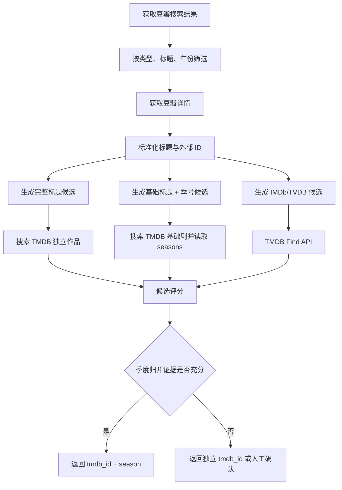

# 豆瓣接口调用与 TMDB 电视剧匹配设计

> 整理日期：2026-07-24
> 参考实现：MoviePilot `v2`，提交 `f6df6cc09384e708b38740da26b2635629006d44`
> 用途：为项目实现“豆瓣搜索/详情获取 -> TMDB 作品与季度匹配”提供设计依据。

## 1. 核心结论

1. MoviePilot 使用的是豆瓣 Frodo 后端中的未公开接口，不是豆瓣面向开发者承诺稳定性的正式开放 API。
2. 聚合搜索端点为：

   ```text
   GET https://frodo.douban.com/api/v2/search/weixin
   ```

3. 请求包含固定结构参数 `apiKey`、`os_rom`，以及按请求方法、URL 路径和日期计算的 `_ts`、`_sig`。
4. `_sig` 不包含关键词、分页等查询参数。因此，同一个 HTTP 方法、同一个路径、同一天生成的签名相同；跨天或换路径时必须重新计算。
5. 搜索响应是电影、电视剧、书籍、人物等类型的混合结果，不能直接采用第一条，必须按 `type_name`、标题、年份等字段过滤。
6. MoviePilot 当前“豆瓣 ID -> TMDB”主要使用标题、原名、年份和类型匹配，并不是严格的跨站 ID 映射。
7. 对电视剧，最终结果应采用：

   ```json
   {
     "tmdb_id": 243236,
     "season": 2
   }
   ```

   而不应只保存一个 `tmdb_id`。
8. `罚罪2`、`罚罪二`、`罚罪 II` 等裸数字写法只能生成“可能是第二季”的候选，不能直接认定为季号。
9. 当 TMDB 同时存在独立重复条目和原剧的对应季度时，在季度年份、集数、别名、演员等证据充分的情况下，优先选择 `{原剧 tmdb_id, season}`。

---

## 2. MoviePilot 中的豆瓣接口

### 2.1 搜索接口

```text
Base URL: https://frodo.douban.com/api/v2
Path:     /search/weixin
Method:   GET
```

常用查询参数：

| 参数 | 示例 | 说明 |
| --- | --- | --- |
| `q` | `罚罪2` | 搜索关键词 |
| `start` | `0` | 起始位置 |
| `count` | `20` | 返回数量 |
| `os_rom` | `android` | MoviePilot 固定传入 |
| `apiKey` | 环境配置 | MoviePilot 源码中为固定值 |
| `_ts` | `20260724` | 本地日期，格式 `YYYYMMDD` |
| `_sig` | Base64 字符串 | HMAC-SHA1 签名 |

完整请求结构：

```text
https://frodo.douban.com/api/v2/search/weixin
  ?q=罚罪2
  &start=0
  &count=20
  &os_rom=android
  &apiKey=<DOUBAN_API_KEY>
  &_ts=20260724
  &_sig=<SIGNATURE>
```

路径名虽然包含 `weixin`，但 MoviePilot 是以 Frodo Android 客户端形式调用它的。不能仅凭路径名把它定义为稳定、正式的“豆瓣微信开放接口”。

### 2.2 签名算法

MoviePilot 的签名原文由三部分组成：

```text
HTTP_METHOD & URL_ENCODED_PATH & YYYYMMDD
```

以搜索接口为例：

```text
GET&%2Fapi%2Fv2%2Fsearch%2Fweixin&20260724
```

签名步骤：

1. 从完整 URL 中只取路径 `/api/v2/search/weixin`。
2. 对路径进行 URL 编码，`/` 编码成 `%2F`。
3. 用 `&` 拼接大写 HTTP 方法、编码后的路径和 `_ts`。
4. 使用 API Secret 对原文计算 HMAC-SHA1。
5. 对摘要进行 Base64 编码，得到 `_sig`。

等价 Python 实现：

```python
import base64
import hashlib
import hmac
from urllib.parse import quote, urlparse


def make_douban_signature(method: str, url: str, ts: str, secret: str) -> str:
    path = urlparse(url).path
    encoded_path = quote(path, safe="")
    raw = "&".join((method.upper(), encoded_path, ts))
    digest = hmac.new(
        secret.encode("utf-8"),
        raw.encode("utf-8"),
        hashlib.sha1,
    ).digest()
    return base64.b64encode(digest).decode("ascii")
```

注意事项：

- `_sig` 不签名 `q`、`start`、`count` 等查询参数。
- 同一天搜索不同关键词时，可以复用搜索路径的签名。
- 切换到详情路径后，需要用详情路径重新签名。
- 日期变化后必须重新生成 `_ts` 和 `_sig`。
- 自己实现时应在请求时生成日期，或者按 `(method, path, date)` 缓存签名。不要把日期写成长期进程中的静态默认参数。
- 不要把 API Key 和 Secret 提交到 Git；使用环境变量或密钥管理服务。

### 2.3 可移植的搜索调用示例

下面只展示调用结构。Key、Secret 和 User-Agent 均从环境变量读取：

```python
import os
from datetime import datetime

import requests


DOUBAN_BASE_URL = "https://frodo.douban.com/api/v2"


class DoubanClient:
    def __init__(self) -> None:
        self.api_key = os.environ["DOUBAN_API_KEY"]
        self.api_secret = os.environ["DOUBAN_API_SECRET"]
        self.user_agent = os.environ["DOUBAN_USER_AGENT"]
        self.session = requests.Session()

    def get(self, path: str, **params) -> dict:
        url = f"{DOUBAN_BASE_URL}{path}"
        ts = datetime.now().strftime("%Y%m%d")
        params.update({
            "os_rom": "android",
            "apiKey": self.api_key,
            "_ts": ts,
            "_sig": make_douban_signature(
                method="GET",
                url=url,
                ts=ts,
                secret=self.api_secret,
            ),
        })

        response = self.session.get(
            url,
            params=params,
            headers={"User-Agent": self.user_agent},
            timeout=(5, 15),
        )
        response.raise_for_status()
        return response.json()

    def search(self, keyword: str, start: int = 0, count: int = 20) -> dict:
        return self.get(
            "/search/weixin",
            q=keyword,
            start=start,
            count=count,
        )

    def movie_detail(self, douban_id: str) -> dict:
        return self.get(f"/movie/{douban_id}")

    def tv_detail(self, douban_id: str) -> dict:
        return self.get(f"/tv/{douban_id}")
```

这里没有复制 MoviePilot 源码中的第三方固定凭据。使用时应自行通过合规方式配置，并接受未公开接口随时失效或变更的风险。

### 2.4 详情接口

MoviePilot 根据媒体类型调用不同详情路径：

```text
电影：GET /api/v2/movie/{douban_id}
电视：GET /api/v2/tv/{douban_id}
```

详情数据中常见的匹配字段包括：

```text
id
title
original_title
year
type / is_tv
episodes_count / 集数相关字段
aka / 别名相关字段
actors
directors
languages
genres
intro
```

字段可能随条目类型或接口版本变化，读取时必须使用容错访问，不能假定所有字段都存在。

### 2.5 搜索响应为什么是混合结果

`/search/weixin` 是聚合搜索。响应主体通常在 `items` 中，每一项大致包含：

```json
{
  "type_name": "电视剧",
  "target": {
    "id": "37106797",
    "title": "罚罪2",
    "year": "2025"
  }
}
```

同一次搜索可能混入电影、电视剧、书籍、人物、小组或其他内容。MoviePilot 的基础过滤方法是：

1. 只保留 `type_name` 为电影或电视剧的项目。
2. 如果调用方指定媒体类型，要求类型完全一致。
3. 要求目标标题包含搜索名称。
4. 在严格匹配阶段继续检查解析后的标题、年份和季号。

可移植的第一层过滤：

```python
MOVIE_TYPES = {"电影"}
TV_TYPES = {"电视剧"}


def extract_media_items(payload: dict, expected_type: str | None = None) -> list[dict]:
    result = []
    for wrapper in payload.get("items") or []:
        type_name = wrapper.get("type_name")
        if type_name not in MOVIE_TYPES | TV_TYPES:
            continue
        if expected_type and type_name != expected_type:
            continue

        target = wrapper.get("target") or {}
        if not target.get("id") or not target.get("title"):
            continue

        result.append({
            "douban_id": str(target["id"]),
            "title": target["title"],
            "year": str(target.get("year") or "") or None,
            "type_name": type_name,
            "raw": target,
        })
    return result
```

不要仅按接口返回顺序选择第一条。搜索排序可能变化，混合结果也可能包含同名但不同类型或不同年份的条目。

---

## 3. 请求稳定性、缓存与限流

MoviePilot 使用了以下手段：

- `requests.Session` 复用连接。
- 从内置 Frodo Android User-Agent 列表中随机选择一个。
- 为 GET/POST 请求增加缓存，并跳过空结果缓存。
- 在业务层检测 `search_access_rate_limit`。
- 使用指数退避装饰器处理限流。
- 部分匹配函数还带有限次重试。

在自己的项目中建议采用更保守的策略：

1. 按 `path + 参数` 缓存搜索和详情结果。
2. 搜索缓存至少保存数小时，详情缓存可保存数天。
3. 同一关键词的并发请求做 single-flight 合并。
4. 收到 `429`、`403` 或 `search_access_rate_limit` 时立即停止重试风暴。
5. 指数退避增加随机抖动，并设置最大重试次数。
6. 限制全局并发和每分钟请求数。
7. 缓存负结果，但负缓存时间应短于正常结果。
8. 不要通过大量更换 IP、账号或客户端指纹来对抗限制。

推荐退避形式：

```text
delay = min(max_delay, base * 2^attempt) + random_jitter
```

这只能降低请求压力，不能保证未公开接口长期可用。生产项目应准备备用数据源、人工回填和本地映射表。

---

## 4. MoviePilot 当前的豆瓣 -> TMDB 方法

MoviePilot 的入口方法是：

```python
get_tmdbinfo_by_doubanid(doubanid, mtype=None)
```

当前流程：

1. 根据豆瓣 ID 获取完整详情。
2. 有 `original_title` 时优先解析原标题，同时保留中文名、英文名。
3. 使用豆瓣年份。
4. 根据豆瓣类型确定电影或电视剧。
5. 按顺序使用原标题、中文名、英文名匹配 TMDB，并去重。
6. 调用 TMDB 的 `match(name, year, type, season_year, season_number)`。
7. 匹配成功后把解析出的 `season` 写入返回值。

TMDB 内部匹配行为：

- 电影和普通电视剧会尝试 `year`、`year + 1`、`year - 1`。
- 电视剧先比较主标题和原标题，再获取详情比较别名、译名。
- 如果已经解析出季号和季度年份，优先验证 TMDB 的该季是否存在且播出年份一致。

### 4.1 当前方法的主要缺口

豆瓣标题本身如果是 `罚罪2`，MoviePilot 通常不会把裸露的末尾 `2` 自动解释为第二季，因此可能按完整标题匹配到一个独立 TMDB 条目。

豆瓣和 TMDB 的建模可能不同：

```text
豆瓣：每一季建立独立 subject
TMDB：一部 TV series 下包含多个 seasons
```

也可能出现 TMDB 同时存在两种建模：

```text
TMDB A：原剧，内部包含第二季
TMDB B：把第二季又建立为独立电视剧
```

因此，仅靠标题和年份不足以决定最终媒体库应采用哪一种结构。

---

## 5. IMDb、TVDB 等外部 ID

如果豆瓣数据能够提供 IMDb ID 或 TVDB ID，应优先生成外部 ID 候选，并通过 TMDB Find API 查询：

```text
GET /3/find/{external_id}?external_source=imdb_id
GET /3/find/{external_id}?external_source=tvdb_id
```

外部 ID 的优势：

- 避免翻译名、繁简体和同名作品造成的歧义。
- 对电影通常能达到很高置信度。
- 可以快速缩小 TMDB 候选范围。

外部 ID 仍不能保证电视剧的最终结构“完美匹配”：

- IMDb ID 常对应整部剧，未必能表示第几季。
- 豆瓣可能把第二季视为独立作品，TMDB 则把它归入原剧第二季。
- TMDB 重复条目可能拥有不同的 IMDb ID。
- 外部 ID 可能缺失、错误或同步滞后。
- 豆瓣中 IMDb ID 比 TVDB ID 更常见，不能依赖每个条目都有 TVDB ID。

因此应把问题拆成两层：

1. **作品身份识别**：这是哪部作品，外部 ID 权重最高。
2. **媒体库结构选择**：应保存为独立 TMDB ID，还是 `{原剧 ID, 第 N 季}`。

外部 ID 很适合解决第一层，但不能单独完成第二层。

---

## 6. 季度标题识别

### 6.1 最重要的规则

**裸数字只生成候选，不直接修改标题。**

对 `罚罪2` 必须同时保留：

```json
[
  {
    "title": "罚罪2",
    "season": null,
    "mode": "exact_title"
  },
  {
    "title": "罚罪",
    "season": 2,
    "mode": "possible_season"
  }
]
```

然后分别查询 TMDB，再用年份、集数、别名和演员决定。

### 6.2 强季度标记

下列形式可以高置信度解析为季度：

```text
罚罪 第二季
罚罪 第2季
罚罪 第 2 季
罚罪 S02
罚罪 S2
罚罪 Season 2
```

解析结果：

```json
{
  "base_title": "罚罪",
  "season": 2,
  "strength": "strong"
}
```

即使是强标记，也要验证 TMDB 基础剧真实存在对应季度，避免错误输入直接污染数据。

### 6.3 弱季度标记

下列形式存在歧义，只能生成候选：

```text
罚罪2
罚罪二
罚罪 II
罚罪 Ⅱ
罚罪 第二部
```

弱标记需要满足后续证据：

- 去掉后缀后能找到基础剧。
- 基础剧存在对应季号。
- 该季播出年份与豆瓣年份相符。
- 集数、别名、演员等至少有一项进一步吻合。

### 6.4 原生数字标题

以下数字通常属于作品名称本身：

```text
神奇女侠1984
1899
1923
24
三体
二十不惑
长安十二时辰
```

处理规则：

1. `1900` 到当前年份附近的四位数默认作为年份或标题组成部分，不解释为季号。
2. 整个标题就是数字时，优先按完整标题搜索。
3. 中文数字位于词中而不是独立后缀时，不拆分。
4. 即使末尾是较小数字，也必须验证基础作品和 TMDB 季度，不能只靠正则表达式。
5. 对 `重案六组4` 这类真实季度式标题，可以通过基础剧存在第 4 季、年份和集数吻合来确认。

### 6.5 标题标准化

生成候选前建议做以下标准化，但保留原始标题：

- Unicode NFKC 标准化。
- 全角数字转半角数字。
- 罗马数字 `Ⅱ` 与 `II` 建立等价候选。
- 中文数字通过可靠库转换，例如 `二 -> 2`，不要手写复杂中文数字算法。
- 繁简体建立别名候选，不覆盖原始值。
- 移除多余空白和可忽略标点。
- 保留年份、原标题、英文名和所有别名。

标准化的目的只是提高比较稳定性，不应丢失原始标题。

---

## 7. 候选生成与双路径匹配

### 7.1 候选类型

对每个豆瓣条目至少生成以下候选：

```text
exact_title       完整中文标题
original_title    原标题
english_title     英文标题
alias             豆瓣别名
base_and_season   去除季度后缀后的基础标题 + 季号
external_id       IMDb/TVDB 精确候选
```

### 7.2 推荐流程



### 7.3 TMDB 需要读取的数据

电视剧候选至少需要：

```text
id
name
original_name
first_air_date
alternative_titles
translations
external_ids
seasons[].season_number
seasons[].air_date
seasons[].episode_count
credits.cast
credits.crew
```

必要时再读取：

```text
/tv/{tmdb_id}/season/{season_number}
```

以获得更准确的季度集数、播出日期和单集信息。

---

## 8. 评分与决策

建议把评分分为“作品身份”和“季度结构”两部分，避免外部 ID 把重复独立条目直接判为最终结构。

### 8.1 作品身份评分

| 证据 | 建议分值 |
| --- | ---: |
| IMDb/TVDB ID 完全一致 | +100 |
| 标准化主标题完全一致 | +35 |
| 原标题或别名完全一致 | +25 |
| 年份一致 | +25 |
| 集数一致 | +20 |
| 主要演员明显重合 | +15 |
| 导演/主创重合 | +10 |
| 类型不一致 | -100 |
| 年份相差超过容忍范围 | -40 |

### 8.2 季度结构评分

| 证据 | 建议分值 |
| --- | ---: |
| 标题明确写出第 N 季 / SNN | +50 |
| 基础剧真实存在 | +20 |
| TMDB 真实存在第 N 季 | +30 |
| 该季播出年份一致 | +30 |
| 该季集数一致 | +25 |
| TMDB 别名包含豆瓣完整续季标题 | +20 |
| 主要演员与上一季/目标季重合 | +15 |
| 仅凭末尾 `2/二/II` | +5 |
| 把四位年份解释为季号 | -100 |
| TMDB 不存在该季度 | -100 |

分值只是初始建议，应使用真实数据集校准。

推荐自动化阈值：

```text
总证据 >= 80 且领先第二候选 >= 15：自动接受
60-79：低置信度，进入复核或延迟重试
< 60：不自动绑定
```

### 8.3 独立 ID 与 `{tmdb_id, season}` 的优先级

不是无条件偏向季度，推荐规则如下：

1. 如果基础剧不存在目标季度，选择独立作品候选。
2. 如果作品确实是重启、衍生剧或独立续集，选择独立作品候选。
3. 如果基础剧存在目标季度，并且季度年份、集数、别名或演员高度吻合，优先 `{基础剧 tmdb_id, season}`。
4. 如果 TMDB 独立条目与基础剧目标季度的年份、集数和演员几乎相同，把独立条目标记为可能重复条目。
5. 无法拉开分差时不要猜，保存多个候选供人工确认。

---

## 9. 本次讨论中的实际案例

以下结果是 2026-07-24 查询时的快照，数据库内容以后可能变化。

### 9.1 豆瓣条目

| 标题 | 豆瓣 ID | 年份 | 集数 |
| --- | --- | ---: | ---: |
| 百花杀 | `36889962` | 2026 | 36 |
| 罚罪 | `35637216` | 2022 | 40 |
| 罚罪2 | `37106797` | 2025 | 40 |
| 飞常日志 | `36553325` | 2024 | 10 |
| 飞常日志2 | `37261428` | 2026 | 10 |

### 9.2 推荐 TMDB 映射

| 豆瓣条目 | 推荐映射 | 说明 |
| --- | --- | --- |
| 罚罪 | TMDB `208919`, Season 1 | 原剧第一季 |
| 罚罪2 | TMDB `208919`, Season 2 | 2025 年、40 集；优先于重复独立条目 |
| 飞常日志 | TMDB `243236`, Season 1 | 2024 年、10 集 |
| 飞常日志2 | TMDB `243236`, Season 2 | 2026 年、10 集；TMDB 未按完整标题返回独立剧 |

### 9.3 “罚罪2”的重复建模

查询时 TMDB 同时存在：

```text
TMDB 208919：罚罪
  Season 1：2022 年，40 集
  Season 2：2025 年，40 集
  别名中包含“罚罪2”

TMDB 296146：罚罪2（独立电视剧条目）
  首播：2025 年
```

直接使用完整标题 `罚罪2 + 2025`，MoviePilot 当前方法容易得到 `296146`。在媒体库按季管理的目标下，推荐结果是：

```json
{
  "douban_id": "37106797",
  "tmdb_id": 208919,
  "media_type": "tv",
  "season": 2,
  "confidence": 0.99,
  "match_mode": "base_title_and_season",
  "alternative_tmdb_ids": [296146]
}
```

### 9.4 “飞常日志2”的季度归并

`飞常日志2 + 2026` 当时没有返回独立 TMDB 搜索结果，但 TMDB `243236` 存在：

```text
Season 1：2024 年，10 集
Season 2：2026 年，10 集
```

因此推荐：

```json
{
  "douban_id": "37261428",
  "tmdb_id": 243236,
  "media_type": "tv",
  "season": 2,
  "confidence": 0.99,
  "match_mode": "base_title_and_season"
}
```

### 9.5 “神奇女侠1984”不能拆季

生成候选时可以做快速否决：

```text
完整标题：神奇女侠1984           -> 合理电影候选
基础标题：神奇女侠 + Season 1984 -> 不合理，直接否决
```

四位数字属于标题，并且完整标题、年份、类型和外部 ID 均可形成强证据，因此不能把它解释为季度。

---

## 10. 推荐的数据模型

不要只保存最终 ID。建议保留匹配过程，以便 TMDB 数据变化后重算：

```json
{
  "source": "douban",
  "douban_id": "37106797",
  "source_title": "罚罪2",
  "source_year": 2025,
  "media_type": "tv",
  "tmdb_id": 208919,
  "season": 2,
  "identity_score": 95,
  "structure_score": 120,
  "confidence": 0.99,
  "match_mode": "base_title_and_season",
  "evidence": [
    "基础标题一致",
    "TMDB存在第二季",
    "季度播出年份一致",
    "季度集数一致",
    "TMDB别名包含罚罪2"
  ],
  "alternatives": [
    {
      "tmdb_id": 296146,
      "season": 1,
      "reason": "可能是TMDB独立重复条目"
    }
  ],
  "matched_at": "2026-07-24T00:00:00+08:00",
  "matcher_version": "1.0"
}
```

推荐建立唯一映射缓存：

```text
douban_id -> tmdb_id + season + matcher_version
```

还应支持人工覆盖：

```text
manual_override = true
```

人工覆盖的优先级应高于自动重新匹配，除非用户主动清除覆盖。

---

## 11. 推荐实现伪代码

```python
def match_douban_to_tmdb(douban_item):
    detail = load_douban_detail(douban_item)

    normalized = normalize_metadata(detail)
    title_hypotheses = build_title_hypotheses(normalized)

    candidates = []

    # 外部 ID 用于作品身份识别。
    for external_id in normalized.external_ids:
        candidates += tmdb_find_by_external_id(external_id)

    # 完整标题、原标题、英文名和别名路径。
    for title in title_hypotheses.exact_titles:
        candidates += tmdb_search(
            title=title,
            year=normalized.year,
            media_type=normalized.media_type,
        )

    # 弱后缀只能生成候选；必须读取基础剧的季度数据验证。
    for hypothesis in title_hypotheses.season_candidates:
        parent_candidates = tmdb_search_tv(title=hypothesis.base_title)
        for parent in parent_candidates:
            season = load_tmdb_season(parent.id, hypothesis.season)
            candidates.append(build_parent_season_candidate(parent, season, hypothesis))

    candidates = deduplicate_candidates(candidates)
    scored = score_identity_and_structure(candidates, normalized)

    winner, runner_up = choose_top_two(scored)
    if winner.score < AUTO_ACCEPT_SCORE:
        return unresolved(scored)
    if runner_up and winner.score - runner_up.score < MINIMUM_MARGIN:
        return needs_review(scored)

    return build_match_result(winner, scored)
```

实现时还应注意：

- `tmdb_id + season` 才是 TV 季度候选的唯一键。
- 特别季使用 `season = 0`，不要与未知季号 `None` 混淆。
- 年份比较分为整剧首播年和目标季度播出年，不能混用。
- 对年份允许小范围容差只适合普通标题搜索；季度归并应优先使用目标季真实播出年。
- 集数可能因特别篇、拆分播出或数据库更新而不同，应允许配置容差。
- 演员比较应做姓名标准化，并避免把同名演员当作强唯一标识。

---

## 12. 建议测试用例

| 输入 | 预期行为 |
| --- | --- |
| `罚罪 第二季` | 强解析为 `罚罪 + S02` |
| `罚罪 第2季` | 强解析为 `罚罪 + S02` |
| `罚罪 S02` | 强解析为 `罚罪 + S02` |
| `罚罪2` | 同时生成完整标题和 `罚罪 + S02` |
| `罚罪二` | 同时生成完整标题和 `罚罪 + S02` |
| `罚罪 II` | 同时生成完整标题和 `罚罪 + S02` |
| `飞常日志2` | 匹配到 TMDB `243236 + S02` |
| `神奇女侠1984` | 保留完整电影标题，不解析季号 |
| `1899` | 保留完整电视剧标题 |
| `1923` | 保留完整电视剧标题 |
| `24` | 保留完整电视剧标题 |
| `三体` | 不生成裸数字季度候选 |
| `二十不惑` | 中文数字在词中，不拆分 |
| `重案六组4` | 生成双候选，使用真实季度数据确认 |
| 同名不同年份作品 | 年份和类型必须参与评分 |
| TMDB 存在重复独立条目 | 有充分季度证据时优先父剧 + season |
| TMDB 不存在目标季度 | 不强行归并，选择独立条目或待确认 |

测试不应只验证正例，还要验证不会误拆原生数字标题。

---

## 13. 落地顺序

推荐按以下顺序实施：

1. 实现豆瓣请求签名、搜索和详情客户端。
2. 增加缓存、全局限速、退避和可观察日志。
3. 实现混合结果过滤与豆瓣候选评分。
4. 接入 TMDB 搜索、详情、外部 ID、别名和季度详情。
5. 实现标题标准化与强季度规则。
6. 实现裸数字的双候选策略。
7. 实现作品身份评分和季度结构评分。
8. 增加人工覆盖及 `douban_id -> tmdb_id + season` 持久化。
9. 用真实案例建立回归测试集。
10. 定期重测未公开豆瓣接口和 TMDB 重复条目变化。

---

## 14. MoviePilot 源码参考

以下链接固定到本次分析的提交版本：

- [豆瓣 API 路径、签名与请求实现](https://github.com/jxxghp/MoviePilot/blob/f6df6cc09384e708b38740da26b2635629006d44/app/modules/douban/apiv2.py)
- [豆瓣搜索、详情、过滤与限流处理](https://github.com/jxxghp/MoviePilot/blob/f6df6cc09384e708b38740da26b2635629006d44/app/modules/douban/__init__.py)
- [根据豆瓣 ID 获取 TMDB 信息](https://github.com/jxxghp/MoviePilot/blob/f6df6cc09384e708b38740da26b2635629006d44/app/chain/media.py#L815-L857)
- [MoviePilot 的 TMDB 匹配入口](https://github.com/jxxghp/MoviePilot/blob/f6df6cc09384e708b38740da26b2635629006d44/app/modules/themoviedb/__init__.py#L635-L675)
- [TMDB 标题、年份与季度匹配实现](https://github.com/jxxghp/MoviePilot/blob/f6df6cc09384e708b38740da26b2635629006d44/app/modules/themoviedb/tmdbapi.py#L281-L503)

---

## 15. 风险说明

- Frodo 接口属于未公开实现，参数、Key、签名和返回结构都可能随时改变。
- 固定 Key 不是永久授权，也不应被视为项目自己的稳定凭据。
- 缓存、退避和降低并发只能减少触发限制的概率，不能保证规避平台风控。
- 项目应遵守适用的服务条款、数据许可和当地法律。
- 对关键业务，必须准备人工映射、备用元数据源和失败降级方案。
